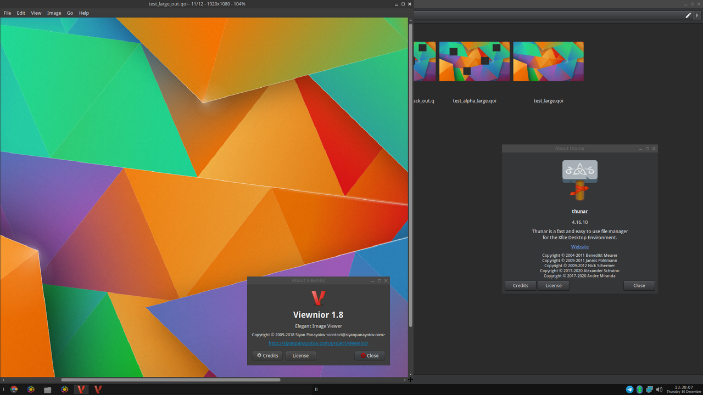

qoi-pixbuf-loader
=================
**qoi-pixbuf-loader** is a [gdk-pixbuf][2] loader for the [QOI][1] image format.

It allows GTK applications to load/save and generate thumbnails for images in
the [QOI][1] image format.



Getting Started
---------------
Before you can compile and install it, be sure to have a compiler and the
[gdk-pixbuf][2] library installed.

```bash
$ make
$ make test
$ sudo make install
```

If you get errors while running `make test`, try and run `sudo make
install-mime-type`, which should resolve the issues.

However, if the errors persist even after that, then obviously do not
attempt to run `sudo make install` as it will surely not work anyway.

Contribute
----------
* Fork the project.
* Make your feature addition or bug fix.
* Do **not** bump the version number.
* Create a pull request. Bonus points for topic branches.

License
-------
Copyright (c) 2021-2022, Mihail Szabolcs

**qoi-pixbuf-loader** is provided **as-is** under the **MIT** license.
For more information see LICENSE.

[1]: https://github.com/phoboslab/qoi
[2]: https://docs.gtk.org/gdk-pixbuf/
